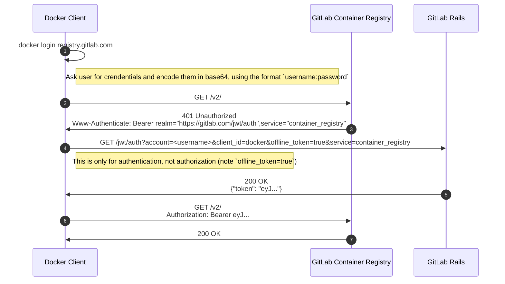
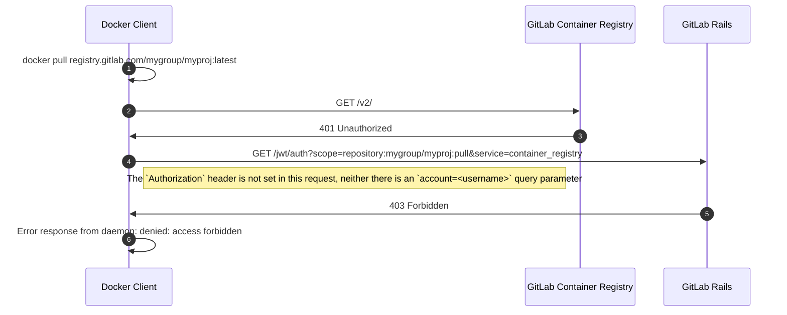
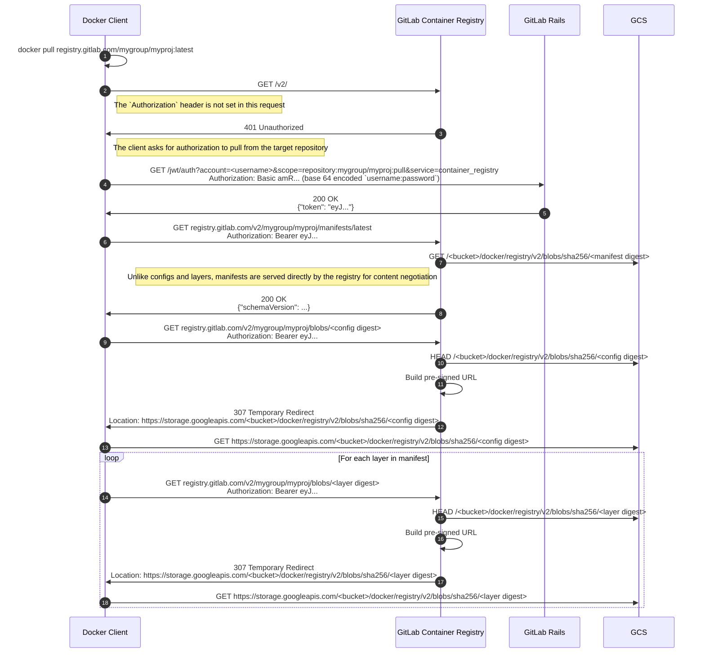
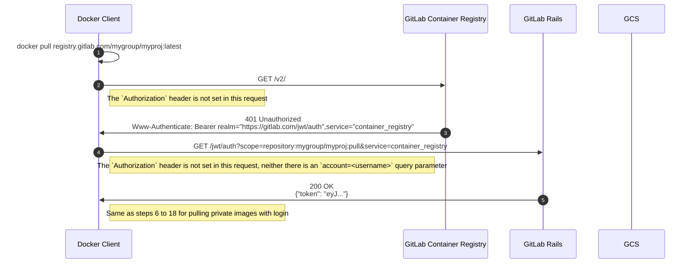
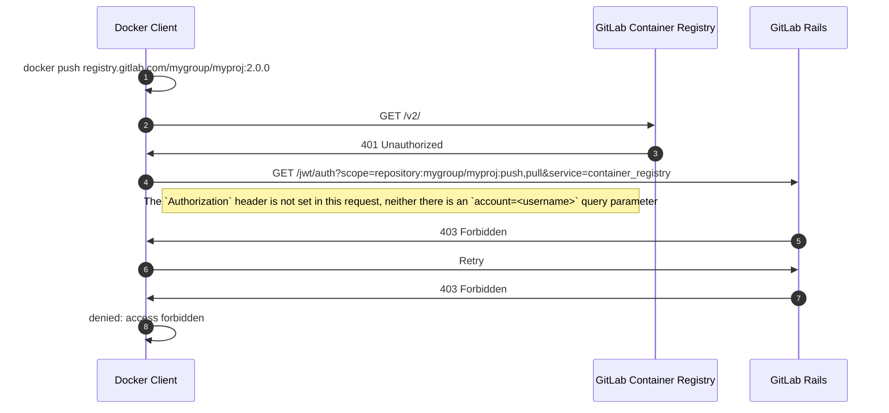
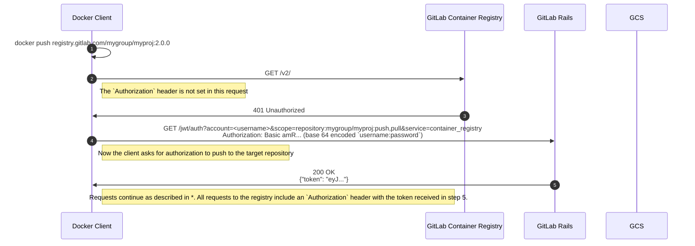
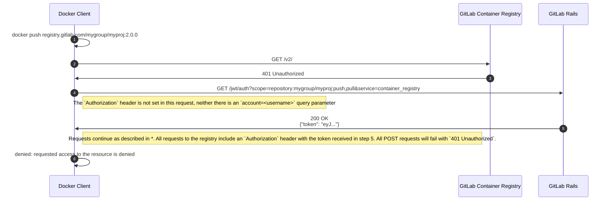

# Authentication Flow

This document illustrates the flow of API requests for the Docker login command, as well as for push/pull commands with and without being logged in.

Although here we use GitLab.com and Google Could Storage as example, the request flow should be the identical for self-managed instances and other storage backends.

## Login

## Pull

### Private Repository

#### Without Login

#### With Login

### Public Repository

#### Without Login

#### With Login

Same steps as without login, but here the request number 4 includes an `account=<username>` query parameter.

## Push

### Private Repository

#### Without Login

#### With Login

`*` See the detailed [push request flow](push-pull-request-flow.md#push)

### Public Repository

#### Without Login

`*` See the detailed [push request flow](push-pull-request-flow.md#push)

#### With Login

Same steps as for pushing to a private repository with login.

