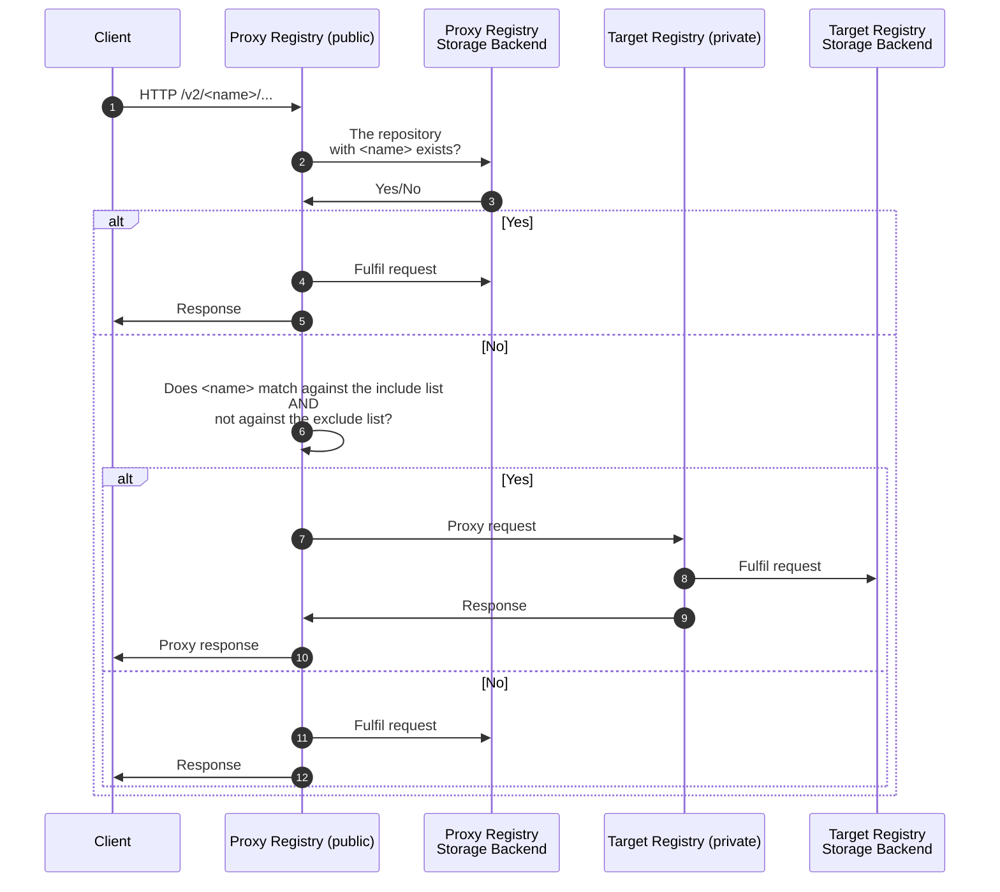

# Migration proxy

The migration proxy mode provides a way to allow an existing registry instance to proxy requests for new repositories (not found in the existing registry storage backend) to a new registry instance backed by the upcoming metadata database. This is a required feature to enable the online migration of large registries.

## How it works



A registry configured as a proxy validates every incoming request and, based on the repository path embedded in every request URL, determines if the target repository is known to the instance or not.

To determine if the repository is known, the proxy registry issues a stat request against its storage backend. In case it exists, the proxy instance fulfills the client request; otherwise, it proxies the request to another registry instance.

The target registry instance only receives requests for repositories that are unknown to the proxy registry, fulfills them, and returns the response through the proxy registry.

The target registry remains hidden from clients, the proxy registry remains the only public and visible entry point for the platform, and handles the request/response proxying internally, without needing an external reverse proxy in front of the two registries.

### Include/exclude lists

To provide more control over which new repositories are proxied to the target registry, which is useful for a gradual migration of large registries, the proxy mode supports include/exclude lists of regular expressions.

When configured, new repositories will only be proxied to the target registry if their name matches against the include list _and_ does not match against the exclude list. If both conditions are not true, the request will be served by the proxy registry. If no include/exclude lists are configured, all new repositories will be proxied to the target registry.

## Configuration

### Proxy instance(s)

The migration proxy mode should be enabled in the existing registry instance(s) only. Settings can be configured in the `migration.proxy` section. Please see the [configuration docs](https://gitlab.com/gitlab-org/container-registry/-/blob/master/docs/configuration.md#proxy) for a list of parameters and their possible values.

The [HTTP secret](https://gitlab.com/gitlab-org/container-registry/-/blob/master/docs/configuration.md#http) configuration parameter (`http.secret`) must be set to ensure that both proxy and target registries use the same piece of data to sign state. This should already be set for clustered environments.

For development purposes an already ready [configuration file](https://gitlab.com/gitlab-org/container-registry/-/blob/master/config/proxy.yml) is present in the config folder.

#### Example

```yaml
http:
  secret: registrysecret
migration:
  proxy:
    enabled: true
    url: https://registry2.example.com
```

#### Example with include and exclude lists

```yaml
http:
  secret: registrysecret
migration:
  proxy:
    enabled: true
    url: https://registry2.example.com
    include:
      - '^myrepo$'
      - '^mygroup/.*$'
    exclude:
      - '^mygroup/keep$'
```

With this configuration, new repositories will only be proxied to the target registry if their name matches `^myrepo$` or `^mygroup/.*$`, but not `^mygroup/keep$`.

### Target instance(s)

The migration proxy mode must _not_ be enabled in the new registry instance(s).

It's required to set the [HTTP secret](https://gitlab.com/gitlab-org/container-registry/-/blob/master/docs/configuration.md#http) configuration parameter (`http.secret`) to the same value as for the existing proxy registry, ensuring that both proxy and target registries share the same piece of data used to sign state.

It's also required to set the [HTTP host](https://gitlab.com/gitlab-org/container-registry/-/blob/master/docs/configuration.md#http) configuration parameter (`http.host`) to the fully-qualified URL of the old/proxy registry. This is used to generate `Location` headers delivered to clients in response to write requests. These `Location` headers must point to the public proxy registry and not to the private target registry.

#### Example

```yaml
http:
  host: https://registry.example.com
  secret: registrysecret
```

For development purposes an already ready [configuration file](https://gitlab.com/gitlab-org/container-registry/-/blob/master/config/proxied.yml) is present in the config folder
